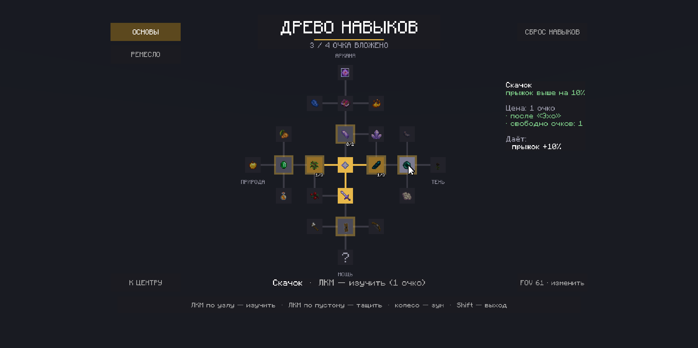

# SkillTree

**English** · [Русский](README.ru.md)



Skill trees for Paper/Folia on a screen made of display entities: a free mouse cursor, panning, zoom, tabs,
tooltips and animations. **No mods and no resource pack** — everything is drawn with vanilla `text_display` and
`item_display`. Built on the ScreenUI screen engine — its jar comes with every SkillTree release.

## Features

- several trees — screen tabs, each with its own points, progress and reset;
- nodes with ranks, hidden nodes, merging branches (any or all parents), level and permission requirements;
- node effects: attributes, permissions, one-time console commands;
- points for XP levels, bonus points by command, players resetting their skills for XP levels;
- icons — vanilla items, Nexo items or resource pack models;
- English and Russian, all texts with MiniMessage markup;
- PlaceholderAPI placeholders;
- highlighting of nodes that can be learned, recenter button.

## Requirements

- Paper or Folia 26.x, Java 25.
- ScreenUI — the screen engine, `ScreenUI-<version>.jar` in the [SkillTree release](https://github.com/Ruha24/SkillTree/releases).
- Optional: [PlaceholderAPI](https://modrinth.com/plugin/placeholderapi) — placeholders,
  [Nexo](https://nexomc.com) — icons from Nexo items.

## Installation

1. Put `ScreenUI-<version>.jar` and `SkillTree-<version>.jar` from the [release](https://github.com/Ruha24/SkillTree/releases) into `plugins/`
   and restart the server.
2. Pick the language in `plugins/ScreenUI/config.yml` (`language: en` or `ru`) — it applies to both plugins.
3. Configure trees in `plugins/SkillTree/trees/*.yml` (two examples by default: `main` and `gathering`).
4. Apply changes: `/skilltree reload`.
5. Optional: the `ScreenUI-shaders.zip` resource pack — screens of the right size at any FOV without calibration
   (see [FOV](#fov)).

Updating from SkillTree 1.0.0 (when it was one plugin named CameraUI): delete the old `CameraUI-1.0.0.jar` and put
both new jars. Settings move to `plugins/ScreenUI`, trees and texts — from `plugins/CameraUI` to `plugins/SkillTree`,
on their own; player progress and FOV stay.
Permissions became `skilltree.use` / `skilltree.admin`, placeholders — `%skilltree_…%`.

## FOV

The screen size depends on the player's FOV, which the server doesn't know. ScreenUI combines two ways:

- **Shader pack** `ScreenUI-shaders.zip` (in the release) — its shaders draw screens as if the FOV were exactly 70,
  every frame. Add it to the server resource pack (with Nexo — `plugins/Nexo/pack/external_packs/` and
  `generate_gif_shaders: false` in Nexo's `settings.yml`) and set `shader-pack: true` in
  `plugins/ScreenUI/config.yml`: players whose server pack loaded need nothing else.
- **Calibration** — before the first screen (for players without the pack), with `/screenui fov` or the "FOV"
  button: the player raises a golden line to the top edge of the screen (FOV), then moves it to the right edge
  (aspect ratio). With working shaders it measures exactly 70, so both ways agree.

Not covered by the shaders: Iris/OptiFine shader packs (such players calibrate), block icons and items with special
models (shield, chest, heads) — use flat items for icons. Tabs and buttons stick to the screen edges on any
monitor — 16:9, 21:9, 16:10.

## Controls

| Action | What it does |
|---|---|
| Mouse | Moves the cursor |
| LMB on a node | Learn the node (next rank) |
| LMB on empty space | Grab / release the tree — dragging |
| Wheel | Zoom around the cursor |
| LMB on a tab | Switch the tree |
| "RESET SKILLS" | Reset the tree for XP levels (confirm with a second click within 3 s) |
| "RECENTER" | Move the tree back to its initial position |
| "FOV … · change" | Calibration |
| Shift | Exit |

## Commands and permissions

| Command | Permission | What it does |
|---|---|---|
| `/skilltree [tree]` | `skilltree.use` (everyone) | Open / close the screen, right on the tree's tab |
| `/screenui fov` | — | Calibration (same: `/skilltree fov`) |
| `/screenui fov <30-110>` \| `reset` | — | Set your FOV as a number / reset calibration |
| `/screenui reload` | `screenui.admin` (op) | Reload ScreenUI `config.yml` and texts |
| `/skilltree reload` | `skilltree.admin` (op) | Reload SkillTree texts and `trees/*.yml` |
| `/skilltree reset <player> [tree]` | `skilltree.admin` | Reset progress in a tree (without a tree — in all). Points are returned, one-time node commands are not undone |
| `/skilltree points <player> [tree]` | `skilltree.admin` | How many points are spent and where they come from: base, levels, bonus |
| `/skilltree points <player> <tree> add\|take\|set <n>` | `skilltree.admin` | Bonus points of a tree — e.g. a quest reward. An open screen updates at once |
| `/skilltree learn <player> <tree> <node>` | `skilltree.admin` | Grant the next rank of a node bypassing parents, level and permission. Points are spent as usual, node commands run |
| `/skilltree unlearn <player> <tree> <node>` | `skilltree.admin` | Take away a rank. A fully forgotten node takes along descendants that needed it; points are returned |

Admin commands work from the console (handy for other plugins), with tab completion, for online players only.

## Configuration

### `plugins/ScreenUI/config.yml`

| Key | Default | What |
|---|---|---|
| `language` | `en` | Language of texts for ScreenUI and the plugins on it: `en`, `ru` |
| `sensitivity` | `0.028` | Cursor speed: screen units per 1° of mouse rotation |
| `fov` | `70` | FOV screens are built for if the player hasn't calibrated |
| `shader-pack` | `false` | `true` — `ScreenUI-shaders.zip` is in the server pack |
| `hud-mode` | `spectator` | How to hide the HUD while a screen is open: `spectator` (no XP bar and crosshair), `creative` (no XP bar), `none` |
| `protection.combat-seconds` | `10` | Seconds after damage during which a screen can't be opened |

### Trees — `plugins/SkillTree/trees/<id>.yml`

Every file is a separate tab; the tree id is the file name. All fields are described in the comments of
`trees/main.yml`. In short:

```yaml
tab: "BASICS"           # tab label
order: 1                # tab order (lower — higher)
title: "SKILL TREE"     # screen title
points: 3               # points every player starts with

level-points:           # points for XP levels (by the highest level reached)
  enabled: true
  every: 5              # amount points every `every` levels — or your own milestones
  amount: 1
  max: 15               # cap (0 — no cap)

respec:                 # player reset: levels + per-point for every spent point
  enabled: true
  levels: 5
  per-point: 1

nodes:
  core: { x: 0, y: 0, icon: nether_star, name: "Core" }   # no parent — a starting node
  a1:
    x: 0                # grid cell, y up
    y: 1
    icon: amethyst_shard          # vanilla item or nexo:<id>; prefer flat items
    # icon-model: ns:path         # resource pack model over the icon
    name: "<light_purple>Crystal"
    description: "+1 luck"
    parent: core                  # or a list: [a1, s1] — any of them is enough
    # parent-mode: all            # with a list: all parents are required
    cost: 1
    ranks: 2                      # how many times it can be learned
    # min-level: 10
    # permission: vip.skills
    # permission-text: "VIP only"
    # hidden: true                # "?" until one of the parents is learned
    effects:
      attributes: { luck: 1 }     # per rank; percent works too: movement_speed: 10%
      # permissions: [ "someplugin.feature" ]
      # commands: [ "xp add {player} 5 levels" ]   # once per rank

labels:                 # branch labels on the field
  - { x: 0, y: 3.55, text: "ARCANA" }
```

If a file has errors, all of them go to the console and the game keeps the previous version of that tree.

### Texts — `messages_<language>.yml`

`plugins/SkillTree/messages_<language>.yml`: the tree screen, hints, the details panel, chat, command replies,
config errors. MiniMessage markup (`<red>`, `<#e8b84a>`), `{name}` placeholders are described next
to each line. Keys missing from a file (added in an update) are taken from the jar.

Your own language: `language: de` in `plugins/ScreenUI/config.yml` — the plugin creates `messages_de.yml` as a
copy of the English file, just translate it. Default trees are created in the server language only on first start, when `trees/` is empty.

## Points and effects

- **A player's points in a tree** = `points` from the config + points for levels + bonus points (granted by command).
- **Points for levels** are counted by the highest level the player has ever reached — death, enchanting and
  resets don't take them away. They are granted on level change and on join, with a chat message.
- **Attributes and permissions** apply while the node is learned and are recalculated on join, respawn, learning,
  reset and `/skilltree reload`. Attribute modifiers with `cameraui:skill/…` keys are saved in the player file;
  if you remove the plugin, remove them with `/attribute … modifier remove`.
- **Commands** run from the console once — when a rank is first reached. After a reset and learning again
  the reward is not given again.
- Data is stored in the player's PDC (their file in the world) — no separate database needed. If you remove a
  node from the config, its id stays with players: bring the node back and the skill returns.

## Placeholders

Requires PlaceholderAPI. For a specific tree — `%skilltree_<tree>_points_free%`, without a tree — the first tab.

| Placeholder | Value |
|---|---|
| `%skilltree_points_total%` / `_spent` / `_free` | Points total / spent / free |
| `%skilltree_points_base%` / `_level` / `_bonus` | Where points come from: config / levels / granted by command |
| `%skilltree_max_level%` | Highest XP level reached |
| `%skilltree_next_point_level%` | Level of the next point (empty — no more) |
| `%skilltree_learned%` / `%skilltree_nodes%` | Nodes learned / total nodes (without starting ones) |
| `%skilltree_learned_<id>%` | Whether the node is learned (at least rank 1): `true` / `false` |
| `%skilltree_rank_<id>%` | Learned rank of the node (0 — not learned) |
| `%skilltree_respec_cost%` | Reset price in levels (empty — reset disabled) |


## Limitations

- The cursor lags by the ping.
- The font is the vanilla pixel one; a smooth one needs a TTF in a resource pack.
- Screens are designed for first-person view. In F5 they look smaller — the camera moves back, and the server
  can't switch the player's view.
- The crosshair is hidden only with `hud-mode: spectator`.
- The camera and the screen hang 64 blocks above the world's height limit. If `entities.tracking-range-y` is
  enabled in `paper-world-defaults.yml`, the screen may not reach the client.
